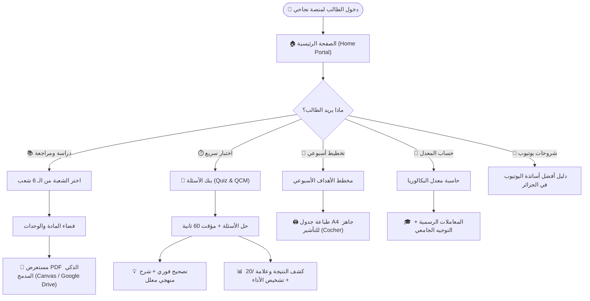
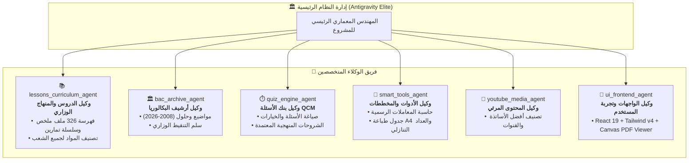

# 🧭 مخطط سير العمل الشامل لمنصة نجاحي (Naja7i Platform Workflow)

دليل بصري شامل يوضح كيف تعمل منصة **نجاحي (Naja7i)**، مسار الطالب (User Journey)، وهيكلة فريق الوكلاء الذكية.

---

## 🎯 1. المخطط العام للرحلة والتجربة (Student User Journey Workflow)

---

## 🤖 2. مخطط توزيع مهام الوكلاء (Multi-Agent Coordination System)

---

## 🗂️ 3. مخطط تدفق البيانات والمستندات (Data & Document Flow)

| القسم / الميزة | مصدر البيانات (Data Source) | طريقة العرض والتفاعل (Presentation) | آلية الحماية والأداء |
| :--- | :--- | :--- | :--- |
| **مكتبة الملفات والدروس** | `userFilesData.js` (326 ملف مفهرس) | `LibraryPage.jsx` & `SubjectViewer.jsx` | فلترة فورية بالبحث والشعبة + تصفح صفحات سريع |
| **مستعرض الـ PDF** | روابط Google Drive أو ملفات محلية | `PdfReaderModal.jsx` | رسم Canvas بدقة عالية أو تضمين Drive مباشر (منيع ضد IDM) |
| **بنك الأسئلة QCM** | `quizData.js` (أسئلة بـ 4 خيارات) | `QuizBankPage.jsx` | عداد زمني + تصحيح فوري وشرح منهجي + حفظ النتائج محلياً |
| **مخطط المراجعة** | `plannerData.js` | `StudyPlannerPage.jsx` | أهداف يومية للمتمدرسين والأحرار + ستايل مخصص لطباعة ورقة A4 واحدة |
| **حاسبة المعدل** | `bacData.js` (معاملات وزارة التربية) | `CalculatorPage.jsx` | حساب فوري للمعدل وتحديد التخصصات الجامعية المتاحة |
