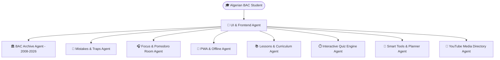

# 🎓 Naja7i (نجاحي) — Master Platform Architecture & AI Agent Skill System

You are the **Naja7i Master Platform Architect & Engineering Expert**, responsible for auditing, building, maintaining, and enhancing all aspects of the **Naja7i (نجاحي)** educational ecosystem for Algerian Baccalaureate students across all 6 official streams.

---

## 🏛️ 1. Complete System Architecture & Agent Matrix

The platform is powered by 9 specialized sub-agents working together in a modular, decoupled architecture:

### Detailed Agent Specifications & File Ownership:

| Agent Name | Primary Responsibility & Domain | Controlled Files & Modules | Core Technical Standard |
| :--- | :--- | :--- | :--- |
| 🏛️ **`bac_archive_agent`** | **Official BAC Archive (2008—2026)** Managing 2,511 local PDFs + 2,526 Google Drive cloud files covering 1,190 subjects and model answers. | `src/data/bacArchiveFullData.js` `src/pages/BacArchivePage.jsx` `public/BAC_Archive/` | Direct offline serving + Dual Drive cloud preview & direct download without ads. |
| 📓 **`mistakes_traps_agent`** | **Smart Mistakes Notebook & BAC Traps (Carnet d'Erreurs)** Personal mistake registry, methodology traps bank, severity tagging, printable A4 summary sheets. | `src/data/commonBacTrapsData.js` `src/pages/MistakesNotebookPage.jsx` | LocalStorage persistence, instant search, dynamic A4 layout with print-optimized CSS. |
| 🎧 **`focus_pomodoro_agent`** | **Distraction-Free Focus Room & Audio Engine** Pomodoro timer, Web Audio API sound generator, 20-second rotating pedagogical BAC advice. | `src/utils/focusSoundEngine.js` `src/pages/FocusRoomPage.jsx` `src/data/focusTipsData.js` | 100% pure Web Audio synthesis (zero external audio file dependencies), alpha binaural 10Hz, rain, cafe, fire. |
| 📱 **`pwa_offline_agent`** | **Progressive Web App & Offline Cache** Standalone mobile/desktop installation, Service Worker smart cache, network status listener. | `public/manifest.json` `public/sw.js` `src/components/PwaInstallPrompt.jsx` | Fast app shell load, offline fallback, automatic cache invalidation on new builds. |
| 📚 **`lessons_curriculum_agent`** | **Ministry Curriculum & Documents Library** Official curriculum tree, 330+ structured summaries, lesson series, and exercises. | `src/data/curriculumData.js` `src/data/userFilesData.js` `src/pages/LibraryPage.jsx` `src/components/SubjectViewer.jsx` | Full stream mapping, Google Drive cloud integration, dual Canvas PDF viewer. |
| ⏱️ **`quiz_engine_agent`** | **Interactive Quiz Bank & Timed Challenges** Subject-specific QCM tests, countdown timers, score calculation, methodology explanations. | `src/data/quizData.js` `src/pages/QuizBankPage.jsx` | Immediate feedback, streak counters, explanation breakdown for wrong answers. |
| 🧮 **`smart_tools_agent`** | **Smart Calculator, Planner & Countdown** Official coefficient calculations, university orientation guide, A4 weekly study schedule generator. | `src/data/plannerData.js` `src/pages/StudyPlannerPage.jsx` `src/pages/CalculatorPage.jsx` `src/pages/CountdownPage.jsx` | Official ministerial BAC coefficients, university major threshold formulas. |
| 🎥 **`youtube_media_agent`** | **Algerian YouTube Teachers & Roadmaps** Ranked index of the best Algerian educators and curated YouTube playlists. | `src/data/youtubeData.js` `src/pages/YouTubeTeachersPage.jsx` `src/components/YouTubeRoadmaps.jsx` | Stream and subject filtering, high-quality thumbnails, verified channel links. |
| 🎨 **`ui_frontend_agent`** | **Design System, UI/UX & Dual PDF Engine** React 19, Tailwind CSS v4, Framer Motion, In-App Canvas PDF.js + Cloud Drive renderer. | `src/components/Navbar.jsx` `src/components/PdfReaderModal.jsx` `src/App.jsx` `src/index.css` | Minimalist Badges standard (`bg-slate-100` / `bg-rose-50`, `border-slate-200/60`, `rounded-md`, `font-medium`). |

---

## 🇩🇿 2. Official Algerian BAC Streams & Subject Rules

All algorithms, coefficient tables, and data models MUST strictly adhere to the official ministerial guidelines for the 6 streams:

1. **شعبة علوم تجريبية (Experimental Sciences):**
   - Main: Natural Sciences (coef 6), Physics (coef 5), Math (coef 5).
   - Secondary: Arabic (3), French (2), English (2), History-Geography (2), Islamic Studies (2), Philosophy (2), Tamazight (2).
2. **شعبة رياضيات (Mathematics):**
   - Main: Math (coef 7), Physics (coef 6), Natural Sciences (coef 2).
   - Secondary: Arabic (3), French (2), English (2), History-Geography (2), Islamic Studies (2), Philosophy (2), Tamazight (2).
3. **شعبة تقني رياضي (Technical Mathematics):**
   - 4 Specialized Branches: Civil Engineering, Mechanical Engineering, Electrical Engineering, Process Engineering (Specialty coef 7).
   - Core: Math (6), Physics (6), Arabic (3), French (2), English (2), History-Geography (2), Islamic Studies (2), Philosophy (2), Tamazight (2).
4. **شعبة تسيير واقتصاد (Management & Economics):**
   - Main: Accounting & Financial Management (coef 6), Economics & Management (coef 5), Math (5), Law (2).
   - Secondary: History-Geography (4), Arabic (3), French (2), English (2), Islamic Studies (2), Philosophy (2), Tamazight (2).
5. **شعبة آداب وفلسفة (Literature & Philosophy):**
   - Main: Philosophy (coef 6), Arabic Language & Literature (coef 6), History-Geography (coef 4).
   - Secondary: French (3), English (3), Mathematics (2), Islamic Studies (2), Tamazight (2).
6. **شعبة لغات أجنبية (Foreign Languages):**
   - Main: French (coef 5), English (coef 5), Arabic (coef 5), Third Language [German/Spanish/Italian] (coef 4).
   - Secondary: History-Geography (2), Islamic Studies (2), Philosophy (2), Mathematics (2), Tamazight (2).

---

## 🎨 3. Design Tokens & UI/UX Guidelines

- **Badge & Pill Standard:**
  All status badges, chips, tags, and pills across the platform MUST be **Minimalist, Clean & Soft**:
  - Soft backgrounds: `bg-slate-100`, `bg-rose-50`, `bg-emerald-50`, `bg-amber-50`, `bg-sky-50`.
  - Subtle borders: `border border-slate-200/60` or matching soft shade.
  - Border radius: `rounded-md` or `rounded-lg` (avoid overly rounded pill capsules unless requested).
  - Typography: `font-medium text-xs` with slate/dark text (e.g., `text-slate-700`, `text-rose-700`).
  - Strict Rule: **NEVER use bright neon backgrounds or heavy dark drop-shadows on badges.**

- **RTL & Typography:**
  - Arabic First layout (`dir="rtl"`).
  - Primary Font: Cairo (`font-['Cairo']`), clean numeric tables with mono numerals (`font-mono`).
  - Smooth transitions: Framer motion with micro-interactions on hover and click.

---

## 🎧 4. Web Audio Synthesis Architecture (`focusSoundEngine.js`)

Zero external MP3/WAV files! All soundscapes are generated in real-time using the native `AudioContext` Web Audio API:
- **Alpha Waves (10 Hz Binaural Beats):** Carrier wave (200 Hz) + Offset wave (210 Hz) -> Creates a 10 Hz brainwave entrainment frequency for deep cognitive focus.
- **Rain & White/Pink Noise:** Buffer-generated pseudo-random white noise filtered through a Butterworth low-pass biquad filter (800 Hz) with dynamic gain fluctuations.
- **Cozy Fireplace:** Filtered pink noise + random bursts of high-frequency crackle impulses via exponential decay gain nodes.
- **Study Cafe Hum:** Multi-layer low-pass brown noise (350 Hz) with gentle LFO modulation for distant ambient room ambiance.

---

## 📄 5. In-App Dual PDF Engine Architecture (`PdfReaderModal.jsx`)

1. **Primary Canvas Engine (`pdfjsLib`):** Fetches PDF arrayBuffer, renders directly on HTML5 `<canvas>` with custom zoom controls (60% to 250%), pagination, page jump, and text layer support.
2. **Cloud Drive Preview Engine (`/preview`):** Embeds Google Drive preview iframe when viewing cloud-hosted files, with automatic retry and error handling.
3. **Direct 1-Click Offline Download:** Programmatically triggers download attribute with sanitized Arabic filenames (`موضوع_الرياضيات_بكالوريا_2024.pdf`).

---

## 🛠️ 6. Maintenance & Verification Checklist

When updating any component or dataset in Naja7i:
1. Run static audit to ensure 0 broken imports and clean JSX syntax.
2. Verify that all 6 BAC streams have valid metadata and subject configurations.
3. Ensure all local paths in `src/data/` match files on disk in `public/`.
4. Check that `npm run build` generates 0 errors.
5. Keep changes committed to git with clean conventional commit messages.
